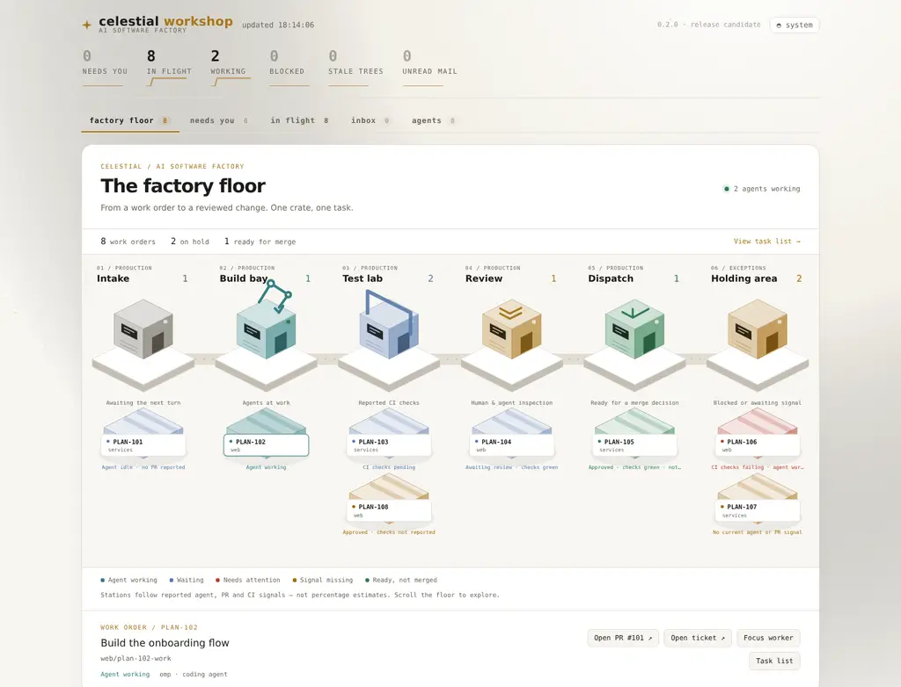

# Celestial — an AI software factory

**Turn work orders into reviewed software with a visible, steerable team of coding agents.**

One clone per dev box. Celestial organises work into *workspaces*, equips
coding agents (Claude Code, oh-my-pi, codex, opencode, pi), and puts
orchestrators and workers into visible [herdr](https://herdr.dev) panes.
Work moves through delegation, implementation, checks and review under your
workspace policy. You stay at the controls: inspect the work, answer blockers
and make the decisions that need a human.

The dashboard is your factory floor. Isometric workstations show each reported
task as a work order in intake, build, test, review, dispatch or the holding
area. Select a crate to inspect its branch, agent and PR, or focus its worker.
Positions follow real reported signals, not invented progress bars; dispatch
means **ready for a merge decision**, not already shipped.

[](LICENSE)



*Illustrative work orders in the live dashboard. No agent execution is simulated.*

---

## Why

Running one coding agent is easy. Running twelve — orchestrators delegating
to workers in worktrees, reviewers gating merges, services on ports, tickets
moving — needs a production system. Celestial supplies the coordination,
visibility and housekeeping around the agents:

- **Every agent runs in a visible pane.** No invisible background subagents;
  if it isn't in a pane, it didn't happen.
- **Policy is injected, not hoped for.** Each workspace declares merge rules,
  ticket schemes, runtimes and reviewers once; every agent launched there gets
  them in its system prompt.
- **The fleet cleans up after itself.** A steward tick collects merged
  worktrees, reaps idle agent processes, nudges stalled reviews, and names
  anything waiting on a human.
- **Every work order has a place on the floor.** The isometric dashboard
  distinguishes active work, waiting, blocked work and missing signals.
  Its task list remains available when you need a denser operational view.

## Give this to your agent

You already have a coding agent — Claude Code, oh-my-pi, pi, codex, opencode.
Paste this into it and let it do the install:

```
Install Celestial on this machine and get it running:
1. git clone https://github.com/geoffwellman/celestial.git ~/celestial-plane
2. Add  eval "$(~/celestial-plane/bin/cel shellenv)"  to my shell rc and load it.
3. Run cel setup, then cel doctor. Fix everything red; ask me for anything
   that needs my account (gh auth login, claude setup-token, pi /login).
4. Ask me: a workspace name, my GitHub org, and the repos I want in it.
   Run cel ws new <name> --org <org>, add the repos to workspace.yaml, run
   cel ws sync <name>, then cel doctor again.
5. Start the console with cel run console, run cel fleet, and show me the
   output and the dashboard URL. Tell me the one command I use from now on.
```

Setup installs third-party code and may invoke `sudo`; read the block before
you paste it, and read [requirements](#requirements) first. If you would
rather type it yourself, the same install is below.

## Quick start

```sh
git clone https://github.com/geoffwellman/celestial.git ~/celestial-plane
eval "$(~/celestial-plane/bin/cel shellenv)"  # add this line to your shell rc
cel setup                                  # review the manifests before installing
cel doctor                                 # verify prerequisites and account setup

cel ws new acme --org your-gh-user  # scaffold a workspace
cel ws sync acme                    # clone its repos, link skills, check tools
cel run console                     # the pane you keep open: routes the whole box
```

`cel run console` is the pane a person keeps open — one per box, across every
workspace. `cd ~/ws/acme && cel run root` is the alternative: it boots that
one workspace's layout with a standing root agent. Pick the console unless you
want a director that lives inside a single workspace and plans for it.

Requires GNU/Linux; automatic prerequisite installation targets apt-based
distributions. Fresh binary installs support x86-64 and arm64. See
[requirements](#requirements) before running setup. Setup installs third-party
code and may invoke `sudo`; it does not supply provider subscriptions or log
you into GitHub, Linear or agent accounts.

## How it works

Three layers on disk, and a factory floor of agents above them.

```
~/celestial-plane          the plane: mechanism only (this repo, public)
├── bin/cel                one CLI for everything
├── core/roles/            role prompts, injected at launch
├── core/skills/           skills linked into every agent
└── agents.yaml            which agents, how to install, how to inject

~/ws/<name>                a workspace: private content + overrides (own repo)
├── workspace.yaml         repos, policy, tickets, runtimes, env, services
├── layouts.yml            herdr layouts (wins over the plane's)
├── externals.yaml         extra tools (additive overlay)
├── skills/                workspace-scoped skills
└── repos/<product>/       the actual product clones (gitignored here)

~/.local/share/cel         box state: registry, published pages (never in git)
```

```
console                one per box - routes; reads cel fleet; never builds
   └── orchestrator        one per product (1..n repos) - plans, delegates, judges, lands
          ├── worker          one ticket, one worktree, one PR
          ├── scout           reads and reports; never writes code
          ├── spike           tries and reports; throwaway code, never shipped
          └── reviewer        one PR, one review per round
```

A **workspace** is not a tier. It is the scope that holds configuration and
grouping: policy, ticket tracker, environment, worker profiles, dashboard. A
**product** is the unit an orchestrator owns — one repo, or several that ship
together. A product that contains all of a workspace's repos is simply "the
workspace orchestrator"; there is no third tier below it, and never was a need
for one. `cel run root` is optional: a standing director for a workspace that
wants one. `root` remains the mailbox name for "the top, whoever is listening",
which is the console otherwise.

`cel run <role>` starts any station with its role injected and permissions
pre-approved; workers are spawned by orchestrators through the `fanout` skill,
which cuts worktrees from origin's real default branch, refuses diverged refs,
and makes every worker land its work as a PR — finished work is never
invisible. `policy.pr_open: draft | ready` decides whether that PR opens as a
draft (default) or ready for review with the workspace reviewer requested.

## Factory vocabulary

The floor has its own words. They are used in the prose below, and none of
them renames a command:

| Word | Means |
|---|---|
| ticket | a work order — the unit a worker is given |
| verdict | the QA gate on a branch: gate result, red-then-green, diff, CI, review |
| land | ship it — squash, merge, clean up |
| steward | the conveyor: the timer that keeps the floor moving without you |
| console | the floor manager's desk: one per box, routes, never builds |

## The review loop runs itself

Declare a reviewer in `workspace.yaml`:

```yaml
review: { runtime: omp, model: gpt-5.6-sol }
```

and orchestrators start one reviewer pane per PR. Reviewers prompt workers
directly on request-changes; workers fix, push, and prompt back for
re-review; you hear about it only on approval or escalation. A steward tick
(every 5 minutes by default, deterministic, token-free) backstops the whole
thing: verified disposable worktrees are removed, positively identified idle
workers can be reaped, stalled PRs are nudged, and blocked agents or preserved
unlanded work are named until dealt with. Unknown state is a reason to retain
work, not evidence that it is safe to delete.

## Agents talk without hijacking your keyboard

`herdr agent prompt` types into a pane, so a status report landing while you
are mid-sentence merges with your draft. Routine agent-to-agent traffic goes
through `cel inbox` instead - a JSONL mailbox per workspace with a read
cursor per recipient - and delivery is out-of-band: recipients run a
`Monitor` background task (`cel inbox watch`) so new mail arrives as a
notification, and a `UserPromptSubmit` hook drains anything missed on your
next turn. Escalations that truly cannot wait still prompt, deliberately.

## Watch and steer

- **`cel fleet`** — the whole box in one deterministic read: every workspace,
  every product, whether its orchestrator is live, workers in flight against
  the cap, stalled and unlanded work. Token-free and free of agent judgement;
  `--json` for scripts. The console answers from this, never from memory.
- **`cel dash`** — per-workspace dashboard: an attention queue ("needs you"),
  every in-flight branch joined with its agent + PR + CI state, sticky
  filters, and a prompt box that drives any agent in the workspace.
- **`cel publish <file>`** — self-hosted pages server (tailnet-private by
  default, per-document promotion to a public tier). Published pages carry a
  feedback widget that routes straight back to the agent that published them —
  select text to comment on the exact passage.
- **`cel gc`** / **`cel steward`** — the cleanup and liveness machinery, also
  runnable by hand.

## What runs in the background

Four kinds of thing run without you: **one timer**, **long-lived servers**, **a
per-turn hook**, and **the agents themselves**. Nothing else is hidden.

### The steward — the only scheduled process

`cel steward` is a single pass over the whole fleet. Its checks do not call a
model, but they can remove verified disposable worktrees, terminate eligible
idle workers, maintain servers and prompt agents. Those agents may then spend
tokens under their existing account permissions.

```bash
cel steward --install                  # systemd user timer, every 5 minutes
cel steward --install --interval 10    # a different cadence
cel steward --install --remove         # stop it
cel steward                            # one tick by hand
systemctl --user list-timers | grep cel-steward
journalctl --user -u cel-steward       # what it did, and when
```

A **systemd user timer** rather than a shell loop in a pane, because the
steward's whole job is to be running when nobody is watching, and a pane loop
dies silently with the herdr session. `Persistent=true`, so a tick missed while
the box slept runs on wake — a ticket moved to the trigger state overnight is
still waiting in the morning. Enable `loginctl enable-linger` or it stops when
you log out.

Each tick, in order:

| Step | What it does |
|---|---|
| **garbage collect** | retains dirty, unlanded, live or unverifiable work; reaps only ownership-verified workers observed idle for 12h (2h under memory pressure), never merely old processes |
| **review sweep** | for each repo, `gh pr list --author @me`: approved PRs, changes-requested with nobody working, and red gates with nobody working each nudge the owning orchestrator |
| **untracked PRs** | a PR older than a day whose branch carries no ticket id — invisible on the board, so it is surfaced |
| **blocked agents** | any agent waiting on input is named every tick, deliberately without dedup; that is your queue |
| **stalled workers** | the one failure no inbox watcher can see: a worker whose provider stream died sends no mail and reads as `idle`. A fatal pane marker (`server_error`, `F5 to Retry`) quiet for 15 minutes, or an agent gone from the roster, escalates to root naming the ticket, pane, stall age, whether the branch is pushed and what is uncommitted — louder when the work is unlanded, because that is when delay costs the work itself |
| **stale mailboxes** | a recipient with unread mail older than 30 minutes has probably lost its inbox monitor, so its pane is told to re-arm and drain |
| **page feedback** | feedback whose publishing pane is gone stays a warning until someone drains it |
| **ready tickets** | tickets in the workspace's `trigger_state` with no branch anywhere are handed to the product's orchestrator, else root — this is what makes "move it to Todo" start work |
| **servers** | `cel dash --ensure` for every workspace declaring a port; expired public shares are deleted, not merely refused |
| **ensure orchestrators** | every product declaring `orchestrator: auto` with no live pane is started with `cel run orchestrator`, at most once every 30 minutes so a crash-looping one is not relaunched every tick |
| **updates** | once a day, whether this plane is behind its latest release |

Nudges are **rate-limited per subject** (4 hours; the update check, 24) through
`~/.local/share/cel/steward-state`, so a stuck orchestrator is reminded rather
than spammed.

### Servers — started on demand, kept alive by the steward

Each runs under `setsid`, so it outlives the pane or agent that started it, and
logs to `~/.local/share/cel/logs/`.

| Service | Where | Kept alive by |
|---|---|---|
| `cel dash` | per workspace, port from `dash.port` | the steward, every tick |
| `cel pages` | tailnet tier, `:7780` | `cel pages --ensure` |
| `cel pages --public` | internet-reachable tier, `:7781` | `cel pages --ensure` |
| `cel pages tunnel` | cloudflared/ngrok, for sharing without Tailscale | started by hand |

`--ensure` is idempotent: it starts the service only if it is not already
answering, so it is safe on a loop.

### The hooks — the only things that touch a live session

Four hooks, all registered in the agent's settings by `cel setup`, all failing
open on their own errors so housekeeping can never take an agent down:

| Hook | Event | What it does |
|---|---|---|
| `inbox-drain.sh` | `UserPromptSubmit` | drains the pane's own mailbox at the start of a turn, so mail is never typed over what you were writing |
| `inbox-guard.sh` | `Stop` | if the pane has **unresolved decisions**, blocks the turn's end once with the count and the re-arm instruction — a dead monitor can no longer go unnoticed |
| `orchestrator-guard.sh` | `PreToolUse` | **read-only orchestrators**: from a root or orchestrator pane, refuses commits, pushes, merges, branch switches and edits under `repos/` (by shell or by the native edit tools). Workers are untouched. `CEL_GUARD=0` opts a pane out; `CEL_GUARD_ALLOW_ONCE=1` approves one call |
| `learn-stow.sh` | `SessionEnd` | decays and budgets the workspace's `learnings.md` |

Identity for all of them comes from the pane's working directory — a workspace
root is `root`, `<ws>/repos/<repo>` is that repo's orchestrator, a worktree is
a worker — so nothing needs env plumbing through herdr.

`cel inbox watch` is the other half of the inbox — a `Monitor` an agent arms
inside its own session to notice mail arriving while it is idle. It is not a
daemon; when it dies, the Stop hook and the steward's stale-mailbox check are
what catch it.

### The agents

The console, the orchestrators, workers, scouts, spikes and reviewers are herdr
panes, not services. They are started by `cel run` and `cel-fanout delegate`,
and they stop when their pane does. `cel-fanout status` is the ledger of what
was delegated, on which model, and where it got to.

The console arms one background task of its own, once per session: `cel inbox
watch --all-workspaces`, so a decision raised in any workspace wakes it rather
than waiting for someone to look. Like every watch it is not a daemon — the
Stop hook and the steward's stale-mailbox check are what notice when it dies.

## Any model, any CLI, per worker

`runtime:` picks the CLI for a role; a **worker profile** picks the CLI *and*
the model *and* the reasoning level, and any launch can be pointed at one:

```yaml
thinking: medium              # default level when no profile applies
worker_profiles:
  default:  { runtime: omp,    model: openai-codex/gpt-5.6-sol, thinking: low }
  astra:    { runtime: codex,  model: gpt-6-astra,              thinking: low }
  deepseek: { runtime: omp,    model: deepseek/deepseek-flash,  thinking: medium,
              fallback: openrouter/deepseek/deepseek-v4.1-flash }
```

Bind a profile to a role and it applies with no flag at all:

```yaml
role_profiles:
  root: opus                  # deepest model for planning and delegation
  orchestrator: default       # cheaper for coordination
  worker: default
  scout: opus                 # read-only research; needs web tools, not volume
```

This is the *only* way to configure root and the orchestrators, because neither
is launched by hand — root comes up from the layout when the workspace boots,
and the sub-orchestrators are started by root itself. A flag for those two is
really an instruction to an agent, and agents forget. `scout` is optional and
falls back to `worker`; bind it when investigations want a different CLI or
model from the one that ships tickets.

```bash
cel profiles                                        # resolutions + role bindings
cel run worker --repo r --branch b --profile astra  # override once
cel-fanout delegate r b spec.md --profile deepseek  # profile lands in the ledger
```

Three things make this more than a flag:

- **Every CLI spells it differently, and the plane knows.** `agents.yaml`
  records each runtime's model flag and how it takes a reasoning level — claude
  `--effort`, omp/pi `--thinking`, codex `-c model_reasoning_effort=…`, opencode
  not at all. A level a runtime doesn't accept is **clamped down its own
  ladder**, never passed through to be rejected at launch.
- **`fallback:` is checked before the pane spawns.** It names the same model
  reached a different way — a direct provider API, or an aggregator. If the
  primary's key is missing from the workspace environment, the fallback is used
  and *said out loud*. Without that check an unauthenticated worker starts,
  prints an auth error and idles, which from outside is indistinguishable from
  one thinking hard.
- **The choice is recorded.** `cel-fanout status` shows which model built which
  branch, so running two profiles at the same ticket is evidence rather than
  anecdote.

Keys live in the workspace's gitignored `env.local`; nothing but the model id
ever reaches this repo.

## Tickets

Set `tickets: { system: linear }` and the plane wires Linear's **official MCP
server** into Claude sessions at sync, while every other runtime shares
`cel-linear` (a thin GraphQL shim). The lifecycle contract —
In Progress on start, In Review + PR link on open, Done on merge — rides the
policy block into every agent.

## Commands

| Command | What |
|---|---|
| `cel setup` / `cel doctor` | install everything / verify the box |
| `cel update [--check·--rollback]` | move to the newest release tag, re-link and re-render, then verify; `--check` prints what you'd get and exits 1 when behind; `--rollback` undoes the last update |
| `cel ws new · add · sync · list · push · env` | workspace lifecycle |
| `cel run console` | the pane you keep open: one per box, routes every workspace |
| `cel run [root·orchestrator·worker·reviewer]` | start an agent, role injected |
| `cel run orchestrator --product <p>` | start the orchestrator for a product (1..n repos) |
| `cel fleet [--json]` | every workspace, product, worker and stall in one read |
| `cel update [--check·--rollback]` | upgrade the plane; check without touching it, undo the last one |
| `cel profiles` | worker profiles and the exact launch flags each resolves to |
| `cel steward --install [--interval m]` | run the steward on a timer (the thing that makes any of it proactive) |
| `cel quota [provider]` | credit left per provider, asked of the provider; a route below its floor is vetoed before a pane spawns |
| `cel learn add · list · reinforce · stow` | durable facts the workspace has established — pinned / aging / perishable — budgeted into every agent's policy block |
| `cel inbox open · resolve` | decisions stay open until resolved; reading one does not answer it |
| `cel-fanout scout <repo> <brief>` | an investigation: disposable worktree, a report as the deliverable, no ticket, no PR |
| `cel-fanout spike <repo> <brief>` | a trial: throwaway code in a disposable worktree, a report as the deliverable, never shipped |
| `cel-fanout land <id>` | the one merge path — fleet-authored, approved, green, gate passed, `policy.merge` allows |
| `cel-verify <worktree>` | a structured verdict for a branch: gate result, red-then-green, diff, CI, review |
| `cel dash` | workspace dashboard |
| `cel publish` / `cel pages` | self-hosted documents |
| `cel gc [--reap h]` | reclaim worktrees + idle agents |
| `cel inbox send · read · count · watch` | agent messages that never type into a pane |
| `cel fleet [--json]` | the whole box in one deterministic read: orchestrator liveness, workers n/cap, stalled and unlanded work per repo, root's mail per workspace |
| `cel steward` | one proactive tick over the whole fleet |
| `cel spike` / `cel promote` | throwaway repo → real repo |

## What lives where

The repo is **mechanism only**. Your setup never lands in it:

| | Where | Committed? |
|---|---|---|
| The tool | `~/celestial-plane` | public repo (this one) |
| Which workspaces exist on this box | `~/.local/share/cel/registry.yaml` | never |
| Published pages | `~/.local/share/cel/pages*` | never |
| Workspace content + overrides | `~/ws/<name>` (own private repo) | yours |
| Secrets | `<ws>/env.local` (gitignored) | never |

Workspace files always win over plane defaults: `layouts.yml` over the plane's
layouts, `externals.yaml` additively, `env:`/`env.local` over your profile,
workspace `skills/` scoped to that workspace's repos only.

### Cleanup safety

GC protects every removal path with delegation and process checks. It requires
a clean attached Git HEAD and proven default-branch ancestry, or a merged PR
whose recorded head is exactly the local HEAD. A missing/broken default,
unknown discovery, running delegation or newer local commit blocks removal.
`cel-fanout release` also refuses uncertain work unless you explicitly choose
`--keep-worktree` or the destructive `--discard`.

The reaper uses herdr foreground-process evidence, a workspace role-file
ownership stamp and a durable observed-idle clock under
`~/.local/state/cel/gc-idle.json`. Its first observation never kills.
Working/blocked/unknown agents, root/orchestrators, manually launched processes
and unsupported ownership stamps are retained regardless of age. Cooperating
fanout operations share lifecycle locks; unrelated manual Git/herdr changes
cannot be made transactional with external tools. Atomic state replacement
prevents partial readers, but is not a promise of power-loss durability.

### Private HTTP services

Private pages and dashboard listeners are local/tailnet control surfaces, not
multi-user authenticated applications. Do not tunnel them onto the public
internet. Published private HTML is trusted active same-origin content.
Only the separate token-addressed public pages tier is intended for sharing.

Private requests require an exact trusted Host. Browser mutations also require
an allowed Origin and a per-process `X-Cel-CSRF` token; built-in controls supply
it automatically. For reverse proxies or extra tailnet names, configure
`CEL_PAGES_TRUSTED_ORIGINS` / `CEL_DASH_TRUSTED_ORIGINS` with comma-separated
exact origins such as `https://control.example` before starting the service.
Forwarded headers never grant trust. Wildcard binding does not grant arbitrary
Host access. Restart after configuration changes.

Local automation reads `{csrfToken}` from `GET /api/session`, then supplies
that value in `X-Cel-CSRF` with `Content-Type: application/json` on mutations.
The session endpoint has no CORS permission and is not available on the public
tier. Generated tokens rotate on restart; stale browser tabs need a reload.
Optional `CEL_PAGES_CSRF_TOKEN` / `CEL_DASH_CSRF_TOKEN` overrides require at least
32 URL-safe characters; treat them as secrets. This is anti-CSRF and
DNS-rebinding protection, **not account authentication**: a directly trusted
local/tailnet caller can obtain the token.

## Requirements

GNU/Linux with Bash, GNU coreutils, `/proc`, Git, Python 3 and
curl **7.55.0 or newer**. Tests and the Node services use Node **24.x**; YAML
processing uses Python `yq` (the jq wrapper), not the Go program of the same
name. [herdr](https://herdr.dev) supplies panes. A systemd user session is
required only for the optional steward timer. macOS and other kernels are
rejected before CLI dispatch.

`cel setup` installs missing prerequisites through apt when available;
otherwise it tells you what to install manually. Fresh application versions
and native checksums live in [`agents.yaml`](agents.yaml), external plugin
commits in [`externals.yaml`](externals.yaml), and Pi extension versions in
[`tools/pi/extensions.txt`](tools/pi/extensions.txt). External overlays must
declare `source` and a full 40-character Git `ref`; legacy version-only
declarations are rejected.

Pins govern **fresh setup**, not a hermetic machine image. Existing executables
are retained (GitHub CLI must be at least 2.90), distribution packages follow
your package sources, and npm transitive dependencies, plugin build
dependencies and later upstream self-updates are not locked by Celestial.
Previously installed plugins from unrelated marketplaces are not silently
removed. Installation/download failures are reported rather than called
success. Review manifests and upstream code before installing.

## Development and security

See [architecture](docs/architecture.md),
[contributing](CONTRIBUTING.md), [security policy](SECURITY.md), and the
[release checklist](docs/release-checklist.md). CI runs the shell/HTTP suite,
source-and-history hygiene checks and a pinned credential scanner. Private
release vocabulary stays outside this repository; the public generic check
alone is not proof that a particular organisation's information is absent.

## Versioning & updates

Celestial follows [semver](https://semver.org); `VERSION` + `v*` tags are the
truth and every release is announced on
[GitHub Releases](https://github.com/geoffwellman/celestial/releases) with
notes from [CHANGELOG.md](CHANGELOG.md) — **Watch → Custom → Releases** to get
notified. On the box, `cel version` tells you what you're running, `cel
doctor` and the steward tell you when you're behind, and `cel update` brings
you current.

## Licence

[MIT](LICENSE) © Geoff Wellman
